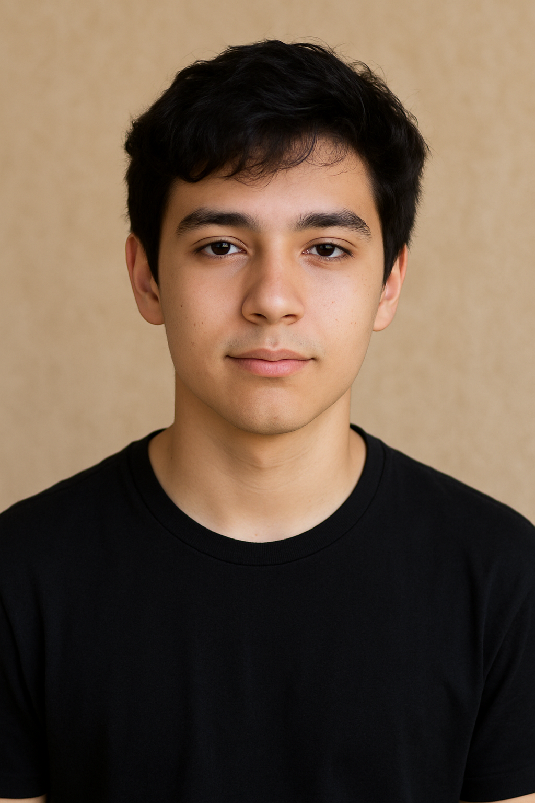

# Olá! Eu sou Flávio

### Sou uma pessoa comunicativa, que gosta de ler, jogar xadrez e valoriza um ambiente leve e colaborativo.

### sobre mim:
- ***Idade: 13***
- ***Cidade: Sorocaba***
- ***Personalidade: Uma pessoa curiosa, analítica e empática, que combina raciocínio lógico com habilidades interpessoais. Adoro aprender, trocar ideias e transformar ambientes em espaços mais leves, produtivos e colaborativos.***
- ***Interesses: gosto de ler civros, jogar xadrex***
- ***O que me motiva:***

### O que gosto de fazer

- Ler livros
- Jogar bola
- Jogar cadrez
- Andar de bike
- Conversar

## Meus objetivos

- Ter boas notas
- Começar a trabalhar
- Ler mais 3 livros até o final do ano
- Terminar meus cursos

## Markdown e documentação digital 
- “Como usar o GitHub para criar e compartilhar ideias”
- “Conceitos de cidadania e segurança online”
“Conceitos de segurança da informação”

### Uma frase que me representa

"Errar é humano, persintir no erro é diabolico" - Santo Agostinho

### Um pouco da minha identidade digital

[Gera no chat gpt uma imagem sua] Imagem ou avatar opcional: ./img/avatar.png

(podem colocar uma imagem livre, um desenho próprio, ou até criar um avatar no Canva ou Bitmoji)

### Como me encontrar

- Opcional — somente se for autorizado pelo facilitador:
- E-mail de contato: [opcional]
- Me encontre no GitHub como [@Flavio Petrini](https://github.com/flaviocostapetrini-design)
